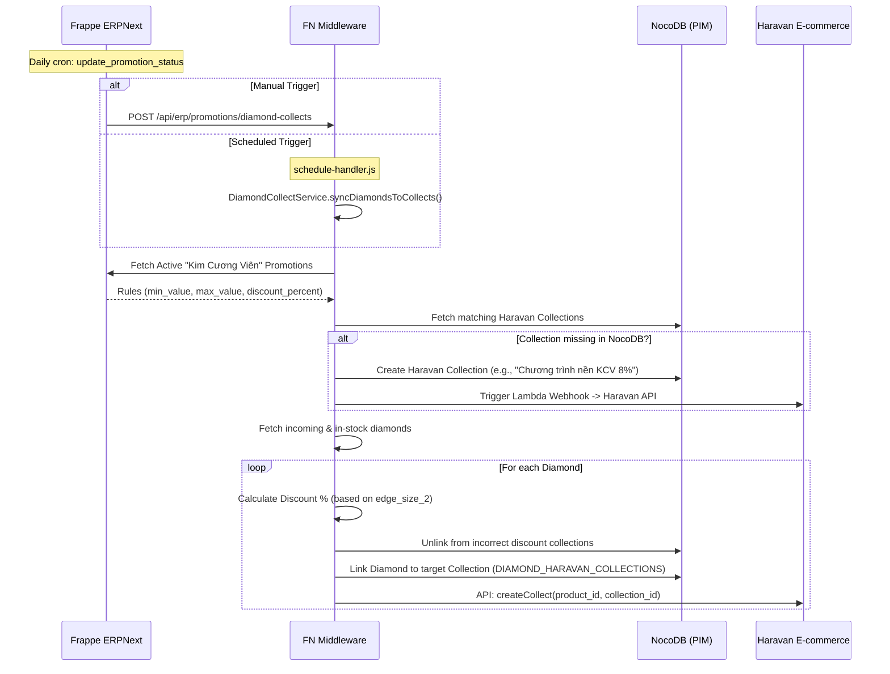
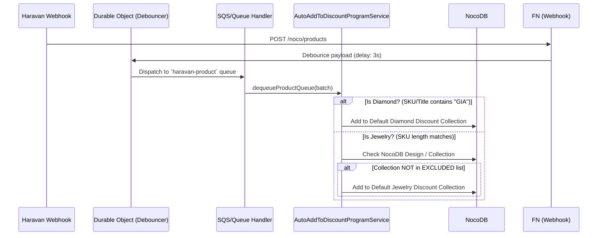

# Diamond Promotion & Synchronization Flow

This document details the automated architecture for managing Base Promotions ("Khuyến mãi nền") for Diamonds and Jewelry, syncing rules from Frappe ERPNext down to NocoDB and Haravan E-commerce.

---

## 1. Batch Synchronization (Cron / Manual Trigger)

The batch sync ensures that the discount rules defined in ERPNext are reflected across the entire active diamond catalog in Haravan. It automatically assigns diamonds to their respective discount collections based on size criteria.

### 1.1. ERPNext Promotion Management (`promotion.py`)
**Path:** `erp/apps/erpnext/erpnext/selling/doctype/promotion/promotion.py`
- **Rules Engine:** Defines `Promotion` documents with start/end dates, minimum/maximum sizes (`min_value`, `max_value`), and discount percentages.
- **State Management:** A hook (`update_promotion_status`) runs daily to activate/deactivate promotions based on date bounds.

### 1.2. FN Core Services (`DiamondDiscountService` & `DiamondCollectService`)
**Path:** `fn/src/services/ecommerce/diamond/`
- **`DiamondDiscountService`**: Fetches ERP promotions matching `product_category="Kim Cương Viên"` and `promotion_type="Khuyến mãi nền"`. Evaluates a diamond's size against the rules to determine the exact discount percent.
- **`DiamondCollectService`**: Orchestrator for the bulk synchronization. 
  - Resolves required Haravan collections for the active rules. If a discount tier (e.g., `8%`) is missing, it creates the collection in NocoDB and triggers an AWS Lambda webhook to push it to Haravan.
  - Queries local database for diamonds with `qty_available > 0` or `is_incoming = true`.
  - Links diamonds to the NocoDB junction table and pushes the `Collect` payload directly to Haravan API.

---

## 2. Real-time Product Event Queue (Webhooks)

When individual products are updated or created in the Haravan ecosystem, the system automatically routes them to the correct base discount program via webhooks and message queues.

### 2.1. Webhook Ingestion & Debouncing
**Path:** `fn/src/controllers/webhook/haravan/noco/product.js`
- Receives `PRODUCT_CREATED` and `PRODUCT_UPDATE` payloads from Haravan.
- Strips heavy payload data to a lightweight `slimData` object.
- Defers processing via Cloudflare Durable Objects (`DebounceService`) for 3 seconds to prevent race conditions during rapid bulk updates, eventually pushing to the `haravan-product` queue.

### 2.2. Auto Assignment Service (`AutoAddToDiscountProgramService`)
**Path:** `fn/src/services/haravan/products/product/auto-add-to-discount-program-service.js`
- **Diamond Detection:** If any product variant SKU or Title contains `GIA`, it assigns the product's NocoDB record to the `DEFAULT_HARAVAN_DIAMOND_DISCOUNT_COLLECTION_ID`.
- **Jewelry Detection:** Evaluates SKU length (`SKU_LENGTH.JEWELRY`) and ensures it is not a "Plain Chain". 
- **Exclusion Logic:** For Jewelry, it performs a lookup against the NocoDB `DESIGNS` and `COLLECTIONS` tables. If the product belongs to premium/special collections (e.g., *Lotus Essence*, *Ngũ Phúc*, *BRILLIANCE GLORY*), it skips the base discount assignment. Otherwise, it assigns the product to `DEFAULT_HARAVAN_JEWELRY_DISCOUNT_COLLECTION_ID`.

---

> [!WARNING]
> **Developer Gotchas**
> * **NocoDB Constraints:** When syncing diamond to collections, error `23505` (Unique constraint violation) is safely ignored because the record already exists.
> * **Haravan Rate Limits:** `DiamondCollectService` intentionally uses `setTimeout` delays (1000ms - 1500ms) between Haravan API mutations and NocoDB deletions to prevent `429 Too Many Requests` errors. Do not remove these throttles.
> * **Collection Exclusion Array:** If marketing introduces a new "Premium/No-Discount" jewelry line, developers must update the `EXCLUDED_COLLECTION_TITLES` array in `AutoAddToDiscountProgramService`.
