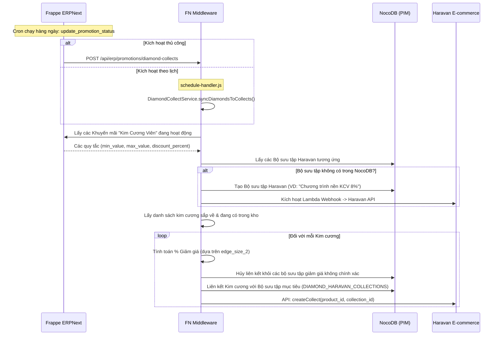
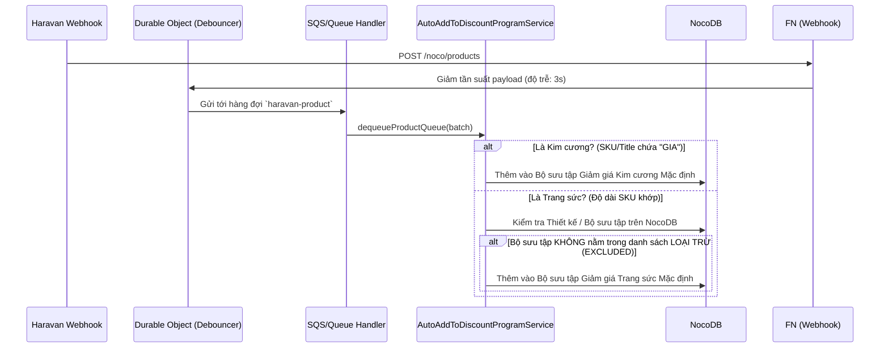

# Quy trình Đồng bộ & Khuyến mãi Kim cương

Tài liệu này trình bày chi tiết về kiến trúc tự động hóa để quản lý các chương trình Base discount cho Kim cương và Trang sức, đồng bộ hóa các quy tắc từ Frappe ERPNext xuống NocoDB và hệ thống thương mại điện tử Haravan.

---

## 1. Đồng bộ hóa hàng loạt (Cron / Kích hoạt thủ công)

Quá trình đồng bộ hóa hàng loạt đảm bảo rằng các quy tắc giảm giá được định nghĩa trong ERPNext được phản ánh trên toàn bộ danh mục kim cương đang hoạt động trên Haravan. Nó tự động gán kim cương vào các collection tương ứng dựa trên tiêu chí về kích thước.

### 1.1. Quản lý Khuyến mãi trên ERPNext (`promotion.py`)
**Đường dẫn:** `erp/apps/erpnext/erpnext/selling/doctype/promotion/promotion.py`
- **Engine Quy tắc:** Định nghĩa các doctype `Promotion` với ngày bắt đầu/kết thúc, kích thước tối thiểu/tối đa (`min_value`, `max_value`) và phần trăm giảm giá.
- **Quản lý Trạng thái:** Một hook (`update_promotion_status`) chạy hàng ngày để activate/deactivate các khuyến mãi dựa trên giới hạn ngày.

### 1.2. Các Service Cốt lõi FN (`DiamondDiscountService` & `DiamondCollectService`)
**Đường dẫn:** `fn/src/services/ecommerce/diamond/`
- **`DiamondDiscountService`**: Lấy các khuyến mãi ERP khớp với `product_category="Kim Cương Viên"` và `promotion_type="Khuyến mãi nền"`. Đánh giá kích thước của kim cương so với các quy tắc để xác định chính xác phần trăm giảm giá.
- **`DiamondCollectService`**: Trình điều phối quá trình đồng bộ hóa hàng loạt. 
  - Phân tích các bộ sưu tập Haravan cần thiết cho các quy tắc đang hoạt động. Nếu thiếu một mức giảm giá (VD: `8%`), nó sẽ tạo bộ sưu tập trong NocoDB và kích hoạt AWS Lambda webhook để đẩy nó sang Haravan.
  - Truy vấn cơ sở dữ liệu cục bộ cho các viên kim cương có `qty_available > 0` hoặc `is_incoming = true`.
  - Liên kết kim cương vào bảng trung gian của NocoDB và đẩy payload `Collect` trực tiếp đến Haravan API.

---

## 2. Hàng đợi Sự kiện Sản phẩm Thời gian thực (Webhooks)

Khi từng sản phẩm được cập nhật hoặc tạo mới trong hệ sinh thái Haravan, hệ thống sẽ tự động định tuyến chúng đến đúng base discount program thông qua webhook và message queue.

### 2.1. Tiếp nhận Webhook & Debouncing (Giảm tần suất)
**Đường dẫn:** `fn/src/controllers/webhook/haravan/noco/product.js`
- Nhận payload `PRODUCT_CREATED` và `PRODUCT_UPDATE` từ Haravan.
- Lược bỏ dữ liệu payload nặng thành một đối tượng `slimData` gọn nhẹ.
- Trì hoãn xử lý thông qua Cloudflare Durable Objects (`DebounceService`) trong 3 giây để ngăn chặn race conditions trong quá trình cập nhật hàng loạt nhanh, cuối cùng đẩy vào hàng đợi `haravan-product`.

### 2.2. Service Gán Tự động (`AutoAddToDiscountProgramService`)
**Đường dẫn:** `fn/src/services/haravan/products/product/auto-add-to-discount-program-service.js`
- **Phát hiện Kim cương:** Nếu SKU hoặc Tiêu đề (Title) của biến thể sản phẩm chứa `GIA`, hệ thống sẽ gán bản ghi NocoDB của sản phẩm cho `DEFAULT_HARAVAN_DIAMOND_DISCOUNT_COLLECTION_ID`.
- **Phát hiện Trang sức:** Đánh giá độ dài SKU (`SKU_LENGTH.JEWELRY`) và đảm bảo nó không phải là "Plain Chain" (Dây chuyền trơn). 
- **Logic Loại trừ:** Đối với Trang sức, hệ thống sẽ kiểm tra đối chiếu với các bảng `DESIGNS` và `COLLECTIONS` của NocoDB. Nếu sản phẩm thuộc về các bộ sưu tập đặc biệt/cao cấp (VD: *Lotus Essence*, *Ngũ Phúc*, *BRILLIANCE GLORY*), nó sẽ bỏ qua việc gán base discount. Ngược lại, nó sẽ gán sản phẩm vào `DEFAULT_HARAVAN_JEWELRY_DISCOUNT_COLLECTION_ID`.

---

> [!WARNING]
> **Lưu ý cho Developer**
> * **Ràng buộc NocoDB:** Khi đồng bộ hóa kim cương vào các bộ sưu tập, lỗi `23505` (Unique constraint violation) được bỏ qua một cách an toàn vì bản ghi đã tồn tại.
> * **Rate Limit của Haravan:** `DiamondCollectService` cố ý sử dụng độ trễ `setTimeout` (1000ms - 1500ms) giữa các mutation của Haravan API và các lượt xóa NocoDB để ngăn chặn lỗi `429 Too Many Requests`. Vui lòng không xóa các hàm throttle này.
> * **Mảng Loại trừ Bộ sưu tập:** Nếu bộ phận Marketing giới thiệu một dòng trang sức "Cao cấp/Không giảm giá" mới, developer phải cập nhật mảng `EXCLUDED_COLLECTION_TITLES` trong `AutoAddToDiscountProgramService`.
