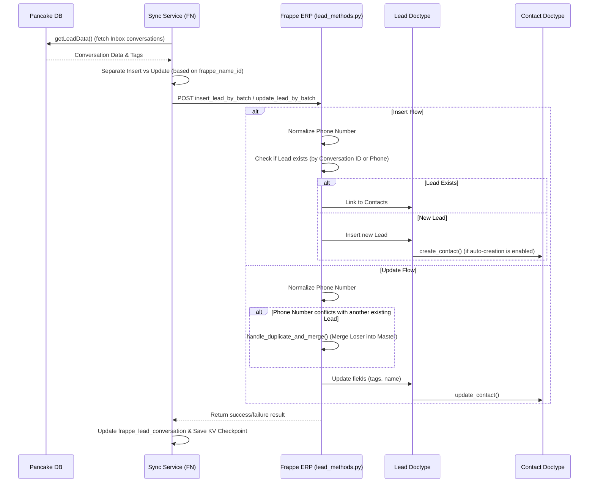
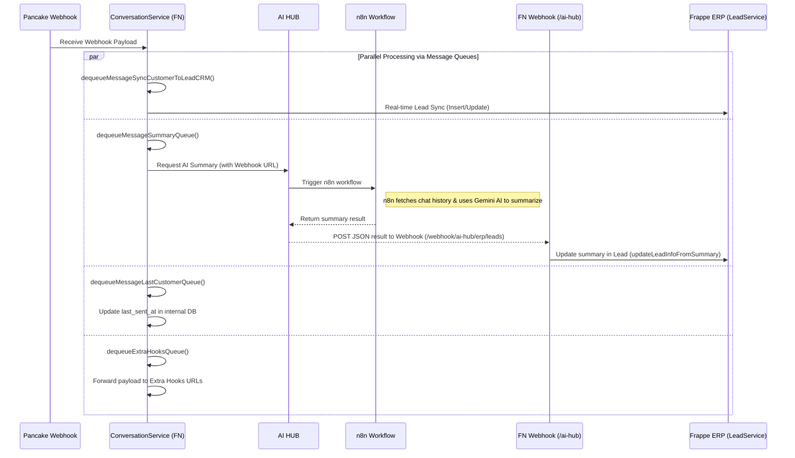
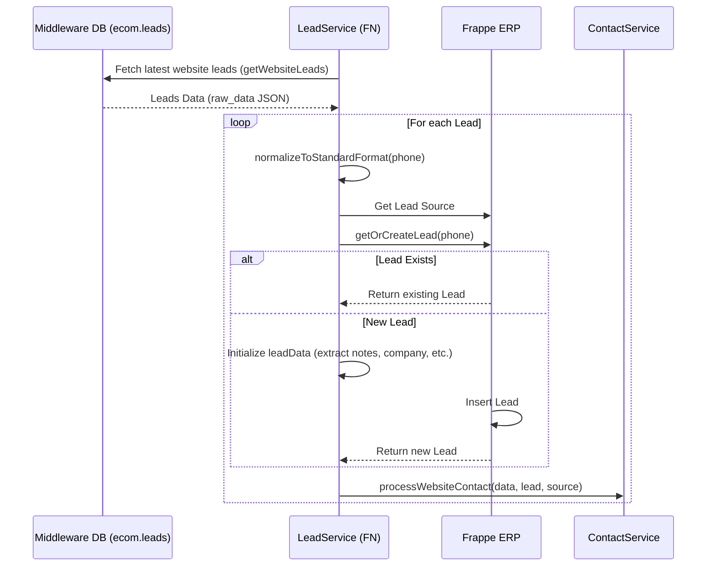
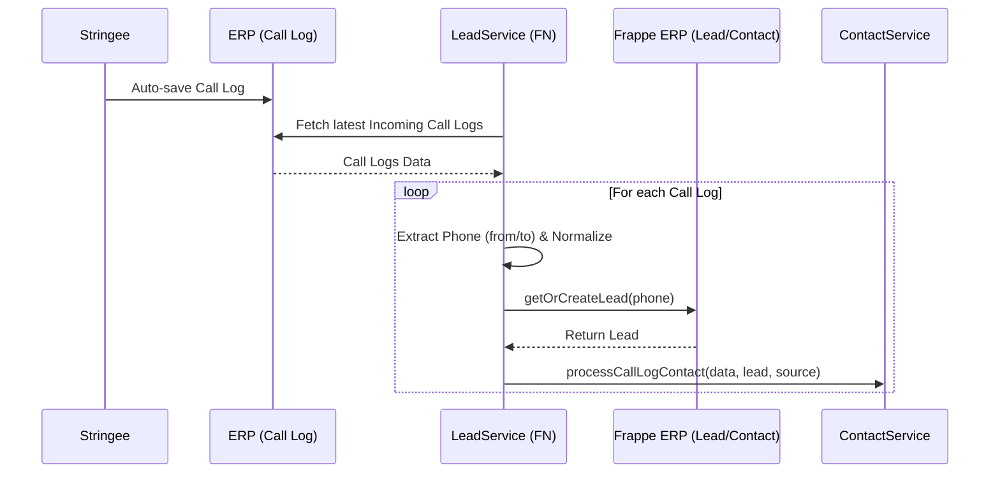

# Lead Flow Detailed Documentation

This document provides a detailed overview of the Lead reception and processing flow within the Jemmia ERP ecosystem. It covers the integration of leads from 3 main sources: **Website**, **Pancake (Social Media / Messaging)**, and **Stringee (Call Center)**.

This document serves as a reference manual for developers to understand the architecture, the sequence of data processing, and critical edge cases (such as deduplication and phone number normalization).

---

## 1. Pancake Flow (Social Media / Messaging)

The Pancake flow continuously syncs customer conversations from Pancake's API/Database to our internal Middleware (FN) and subsequently to the Frappe ERP backend.

### Architecture & Sequence
The synchronization is orchestrated by the `PancakeLeadSyncService` and runs in batches.

### Key Behaviors
- **Batch Processing**: Leads are fetched in chunks (default 50) based on `updated_at` checkpoints stored in Cloudflare KV (`pancake_lead_sync_last_time`).
- **Frappe Validation**: On insertion/update, the ERPNext backend (`validate` & `insert_lead` hooks) runs several critical checks:
  - **Deduplication**: Checks if a Lead with this `conversation_id` or `phone` already exists. It also checks for `email_id` uniqueness (unless `allow_lead_duplication_based_on_emails` is enabled in CRM Settings).
  - **Email Rules**: Validates the email format and ensures the `email_id` is not exactly the same as the `lead_owner`'s email.
  - **Name Formatting**: Automatically parses `first_name`, `middle_name`, and `last_name` from `lead_name`. If no name or company name is provided, it blocks the creation.
- **Contact Creation**: A `Contact` document is automatically created (`create_contact`) and linked to the `Lead`, storing tracking data such as `pancake_conversation_id`, `pancake_page_id`, and `ad_ids`.
- **Assignment**: The Lead owner (`lead_owner`) is assigned based on the `pancake_user_id`. If the user is not found (e.g., resigned employee), it defaults to `tech@jemmia.vn`.

### Webhook Flow (Real-time)

In addition to batch synchronization (cron job), the system also receives data from Pancake via Webhooks (processed in `conversation.js`). This enables real-time Lead syncing and triggers the AI conversation summarization feature.

**Key Webhook Behaviors**:
- **Real-time Sync**: As soon as a new message containing a phone number (`has_phone`) arrives, `syncCustomerToLeadCrm` is called to immediately push customer information to the ERP system as a Lead (using the shared Frappe Insert/Update logic).
- **AI Summarization (AI HUB & n8n)**: 
  - `summarizeLead` in FN calls **AI HUB** (passing a Webhook URL to receive the result).
  - AI HUB acts as an intermediary, triggering the **n8n workflow**. 
  - The n8n system automatically fetches the conversation history from Pancake, uses the Gemini AI model to extract a summary, and sends back the result. 
  - Finally, the JSON result is returned to the FN system via the provided Webhook URL (`/webhook/ai-hub/erp/leads`). The FN Controller then calls the Frappe ERP API to save this content.
- **Extra Hooks Trigger**: Forwards the payload to third-party systems/services configured in `EXTRA_HOOKS`.

---

## 2. Website Flow (E-commerce)

Leads from the website are collected in the `ecom.leads` table in the local database and periodically synced to Frappe ERP.

### Architecture & Sequence

### Key Behaviors
- **Cron Job**: Triggered via `LeadService.syncWebsiteLeads()`. Scans data from the past 1 hour and 5 minutes.
- **Detailed Data Extraction**: The `raw_data` JSON structure is parsed to extract fields like `join_date`, `demand`, `diamond_note`, `company`, `title`, and `guests`. This information is aggregated and pushed to the Frappe Lead as **Notes (`notes`)**.
- **Fallback Name**: If the customer's name is completely missing, the system defaults to `"Chưa rõ"`.

---

## 3. Stringee Flow (Call Logs)

Incoming calls tracked by the Stringee call center system are recorded as Leads.

### Architecture & Sequence

### Key Behaviors
- **Identification**: Extracts the phone number from the `from` field (if Incoming) or the `to` field.
- **First Reach At**: Sets the `first_reach_at` time to the `creation` time of the call log.

---

## System Core Mechanisms

> [!IMPORTANT]
> The following mechanisms are deeply embedded in the synchronization process and are crucial for data consistency.

### 1. Phone Number Normalization
Both JS and Python enforce strict phone number normalization.
- Removes spaces, dashes (`-`), and parentheses `()`.
- Removes leading `+` and `00`.
- Converts local numbers (e.g., `0955...`) or `840...` to the international format without `+` (e.g., `84955...`).
- This ensures highly accurate duplicate checks in the database.

### 2. Deduplication & Merging
To prevent data garbage, if a Lead sync attempt tries to update a phone number to one that *already exists* in another Lead, the system triggers the `handle_duplicate_and_merge()` function.
- **Master vs Loser**: The system compares the `first_reach_at` date. The **older** Lead becomes the Master, and the **newer** Lead becomes the Loser (to be discarded).
- **Transfer**: All related data fields, addresses, contacts, appointments, tags, system fields (`_assign`), and child tables (like Notes) are transferred to the Master lead.
- **Deletion**: The Loser lead is permanently deleted from the system.

### 3. Contact Document Linking
- **Dynamic Links**: A `Contact` document is linked back to the `Lead` via the `Dynamic Link` feature.
- **One Contact Per Conversation**: The `check_contact(page_id, conversation_id)` function ensures the system does not create duplicate contacts.
- **Summary Timestamp**: When lead information is updated via summary extraction, the system avoids loading the entire document to optimize DB performance (`update_contact_summary_timestamp`).

---

## Developer Gotchas & Guidelines

> [!WARNING]
> Before modifying the Lead flow, carefully read these guidelines to avoid breaking data synchronization.

- **Checkpoints (Stored in KV Store)**: Pancake synchronization relies on Cloudflare KV (`pancake_lead_sync_last_time`). If data stops syncing, check the KV. Workers advance the checkpoint but always keep a 1-minute overlap buffer (`now.subtract(1, "minute")`) to avoid missing burst messages.
- **Batch Processing Rate Limits**: The `insert_lead_by_batch` function limits requests to a maximum of `200` records to avoid Python timeouts. The JS cron runs with a default batch size of `50`. Never arbitrarily increase the `BATCH_SIZE` constant in `PancakeLeadSyncService`.
- **Qualification Logic**: The Lead's `qualification_status` auto-updates when fields change (via the `before_save` hook). It only *auto-qualifies*; it *never auto-disqualifies* unless manually performed by a human.
- **Exception Handling**: All batch processes record failures (log failures) and gracefully skip them (but set `hasError = true` in JS to log the error). Frappe returns an array of `failed_docs`. *Do not break/throw the entire batch* if only one row fails; ensure errors are caught (try/catch) for each iteration.
- **Database Indexing**: The `ecom.leads` table and the `tabLead.phone` column in Frappe must always be indexed, as they are queried extremely frequently in `getOrCreateLead`.

