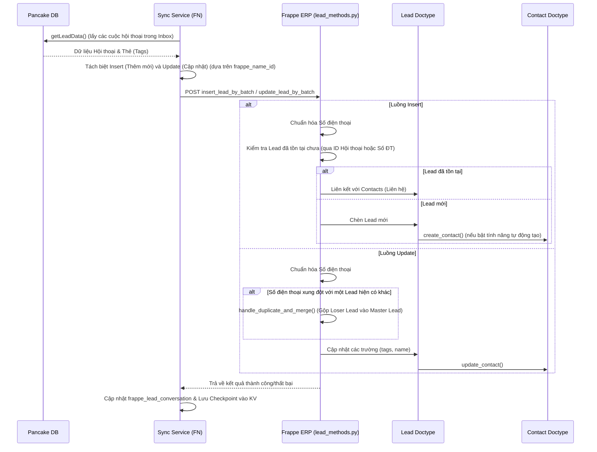
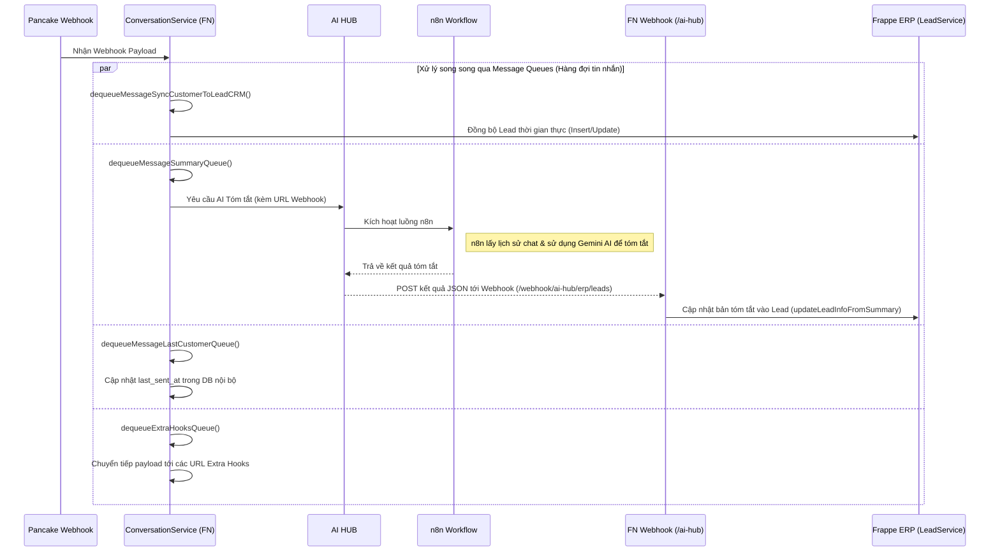
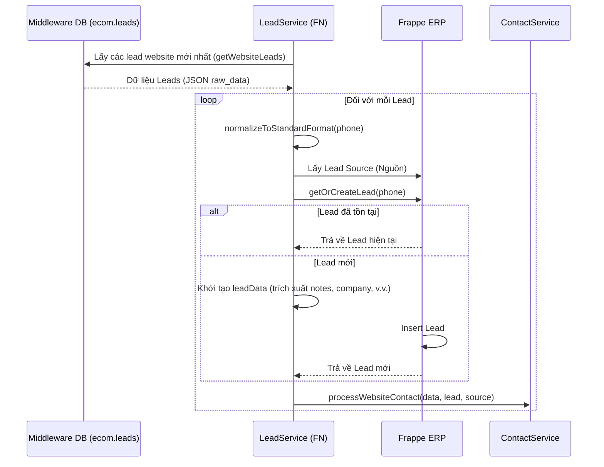
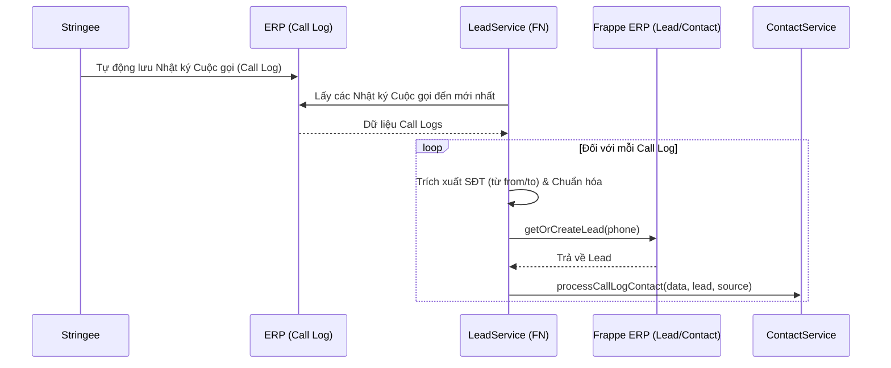

# Tài liệu Chi tiết Quy trình Lead (Khách hàng tiềm năng)

Tài liệu này cung cấp cái nhìn tổng quan chi tiết về quy trình tiếp nhận và xử lý Lead trong hệ sinh thái Jemmia ERP. Nó bao gồm việc tích hợp các Lead từ 3 nguồn chính: **Website**, **Pancake (Mạng xã hội / Tin nhắn)**, và **Stringee (Tổng đài Call Center)**.

Tài liệu này đóng vai trò là một cẩm nang tham khảo cho các developer để hiểu về kiến trúc, trình tự xử lý dữ liệu, và các trường hợp đặc biệt quan trọng (như chống trùng lặp và chuẩn hóa số điện thoại).

---

## 1. Quy trình Pancake (Tin nhắn)

Quy trình Pancake liên tục đồng bộ hóa các cuộc hội thoại của khách hàng từ API/Database của Pancake đến Middleware nội bộ (FN) và sau đó đưa vào backend Frappe ERP.

### Kiến trúc & Trình tự
Quá trình đồng bộ được điều phối bởi `PancakeLeadSyncService` và chạy theo từng lô (batch).

### Các hành vi chính
- **Xử lý theo lô (Batch Processing)**: Leads được lấy về theo từng batch (mặc định 50) dựa trên các mốc checkpoint `updated_at` được lưu trữ trong Cloudflare KV (`pancake_lead_sync_last_time`).
- **Xác thực tại Frappe**: Khi thêm mới/cập nhật, backend ERPNext (các hook `validate` & `insert_lead`) thực hiện một số kiểm tra quan trọng:
  - **Chống trùng lặp**: Kiểm tra xem một Lead với `conversation_id` hoặc `phone` này đã tồn tại hay chưa. Nó cũng kiểm tra tính duy nhất của `email_id` (trừ khi bật tùy chọn `allow_lead_duplication_based_on_emails` trong CRM Settings).
  - **Quy tắc Email**: Xác thực định dạng email và đảm bảo `email_id` không trùng khớp hoàn toàn với email của người phụ trách (`lead_owner`).
  - **Định dạng Tên**: Tự động phân tích cú pháp `first_name`, `middle_name`, và `last_name` từ `lead_name`. Nếu không có tên cá nhân hoặc tên công ty nào được cung cấp, nó sẽ chặn việc tạo mới.
- **Tạo Liên hệ (Contact Creation)**: Một Contact doctype được tự động tạo (`create_contact`) và liên kết với `Lead`, lưu trữ các dữ liệu theo dõi như `pancake_conversation_id`, `pancake_page_id`, và `ad_ids`.
- **Phân công (Assignment)**: Lead Owner (`lead_owner`) được gán dựa trên `pancake_user_id`. Nếu không tìm thấy user (VD: nhân viên đã nghỉ việc), nó sẽ mặc định gán cho `tech@jemmia.vn`.

### Quy trình Webhook (Thời gian thực)

Ngoài việc đồng bộ hóa theo cronjob, hệ thống cũng nhận dữ liệu từ Pancake qua các Webhook (được xử lý trong `conversation.js`). Điều này cho phép đồng bộ Lead theo thời gian thực và kích hoạt tính năng tóm tắt hội thoại bằng AI.

**Các hành vi chính của Webhook**:
- **Đồng bộ thời gian thực**: Ngay khi một tin nhắn mới có chứa số điện thoại (`has_phone`) được gửi đến, `syncCustomerToLeadCrm` sẽ được gọi để đẩy ngay thông tin khách hàng tới hệ thống ERP dưới dạng Lead (sử dụng chung logic Insert/Update của Frappe).
- **Tóm tắt bằng AI (AI HUB & n8n)**: 
  - Hàm `summarizeLead` trong FN gọi **AI HUB** (truyền kèm một URL Webhook để nhận kết quả).
  - AI HUB đóng vai trò trung gian, kích hoạt **luồng n8n**. 
  - Hệ thống n8n tự động lấy lịch sử hội thoại từ Pancake, sử dụng mô hình AI Gemini để trích xuất bản tóm tắt và gửi lại kết quả. 
  - Cuối cùng, kết quả JSON được trả về hệ thống FN qua URL Webhook đã cung cấp (`/webhook/ai-hub/erp/leads`). FN Controller sau đó gọi Frappe ERP API để lưu nội dung này.
- **Kích hoạt Extra Hooks**: Chuyển tiếp payload đến các hệ thống/dịch vụ của bên thứ ba được cấu hình trong `EXTRA_HOOKS`.

---

## 2. Quy trình Website (E-commerce)

Lead từ website được thu thập vào bảng `ecom.leads` trong cơ sở dữ liệu nội bộ (Middleware DB) và được đồng bộ định kỳ sang Frappe ERP.

### Kiến trúc & Trình tự

### Các hành vi chính
- **Cron Job**: Được kích hoạt qua `LeadService.syncWebsiteLeads()`. Quét dữ liệu từ 1 giờ 5 phút qua.
- **Trích xuất dữ liệu chi tiết**: Cấu trúc JSON `raw_data` được phân tích để trích xuất các trường như `join_date`, `demand`, `diamond_note`, `company`, `title`, và `guests`. Thông tin này được tổng hợp và đẩy vào Frappe Lead dưới dạng **Notes (`notes`)**.
- **Tên mặc định**: Nếu tên khách hàng hoàn toàn bị thiếu, hệ thống mặc định là `"Chưa rõ"`.

---

## 3. Quy trình Stringee (Nhật ký Cuộc gọi)

Các cuộc gọi đến được theo dõi bởi hệ thống tổng đài Stringee sẽ được ghi nhận là Leads.

### Kiến trúc & Trình tự

### Các hành vi chính
- **Nhận diện**: Trích xuất số điện thoại từ trường `from` (nếu là Cuộc gọi đến) hoặc trường `to`.
- **Lần tiếp cận đầu tiên**: Đặt thời gian `first_reach_at` thành thời gian `creation` (tạo) của nhật ký cuộc gọi.

---

## Các Cơ chế Cốt lõi của Hệ thống

> [!IMPORTANT]
> Các cơ chế sau đây được nhúng sâu vào quá trình đồng bộ hóa và rất quan trọng đối với tính nhất quán của dữ liệu.

### 1. Chuẩn hóa Số điện thoại
Cả JS và Python đều thực thi chuẩn hóa số điện thoại một cách nghiêm ngặt.
- Loại bỏ khoảng trắng, dấu gạch ngang (`-`), và dấu ngoặc đơn `()`.
- Loại bỏ dấu `+` và `00` ở đầu.
- Chuyển đổi các số nội địa (VD: `0955...`) hoặc `840...` sang định dạng quốc tế không có `+` (VD: `84955...`).
- Điều này đảm bảo tính chính xác cao khi kiểm tra trùng lặp trong cơ sở dữ liệu.

### 2. Chống trùng lặp & Gộp (Deduplication & Merging)
Để ngăn chặn rác dữ liệu, nếu một quá trình đồng bộ Lead cố gắng cập nhật một số điện thoại thành một số *đã tồn tại* ở một Lead khác, hệ thống sẽ kích hoạt hàm `handle_duplicate_and_merge()`.
- **Master (Chính) vs Loser (Phụ)**: Hệ thống so sánh ngày `first_reach_at`. Lead **cũ hơn** trở thành Master, và Lead **mới hơn** trở thành Loser (sẽ bị loại bỏ).
- **Chuyển giao**: Tất cả các trường dữ liệu liên quan, địa chỉ, liên hệ, lịch hẹn, thẻ (tags), các trường hệ thống (`_assign`), và các bảng con (như Notes) đều được chuyển sang Lead Master.
- **Xóa**: Lead Loser bị xóa vĩnh viễn khỏi hệ thống.

### 3. Liên kết Tài liệu Contact (Liên hệ)
- **Liên kết động (Dynamic Links)**: Một tài liệu `Contact` được liên kết ngược lại với `Lead` thông qua tính năng Dynamic Link.
- **Một Contact cho mỗi Hội thoại**: Hàm `check_contact(page_id, conversation_id)` đảm bảo hệ thống không tạo các liên hệ trùng lặp.
- **Timestamp Tóm tắt**: Khi thông tin lead được cập nhật qua việc trích xuất tóm tắt, hệ thống sẽ tránh việc tải lại toàn bộ tài liệu để tối ưu hiệu suất DB (`update_contact_summary_timestamp`).

---

## Lưu ý & Hướng dẫn cho Developer

> [!WARNING]
> Trước khi sửa đổi quy trình Lead, hãy đọc kỹ các hướng dẫn này để tránh làm hỏng việc đồng bộ hóa dữ liệu.

- **Checkpoints (Lưu trong KV Store)**: Việc đồng bộ Pancake phụ thuộc vào Cloudflare KV (`pancake_lead_sync_last_time`). Nếu dữ liệu ngừng đồng bộ, hãy kiểm tra KV. Các worker sẽ đẩy checkpoint tới nhưng luôn giữ một bộ đệm trùng lặp 1 phút (`now.subtract(1, "minute")`) để tránh bỏ sót các tin nhắn dồn dập (burst messages).
- **Giới hạn tỷ lệ Xử lý theo lô**: Hàm `insert_lead_by_batch` giới hạn các request ở mức tối đa `200` bản ghi để tránh lỗi timeout của Python. Cron trong JS chạy với kích thước batch mặc định là `50`. Tuyệt đối không được tùy tiện tăng hằng số `BATCH_SIZE` trong `PancakeLeadSyncService`.
- **Logic Đánh giá mức độ tiềm năng (Qualification)**: Trạng thái `qualification_status` của Lead tự động cập nhật khi các trường thay đổi (qua hook `before_save`). Nó chỉ *tự động đánh giá đạt*; nó *không bao giờ tự động đánh giá trượt* (disqualify) trừ khi được con người thực hiện thủ công.
- **Xử lý Ngoại lệ**: Tất cả các tiến trình batch đều ghi lại lỗi (log failures) và khéo léo bỏ qua chúng (nhưng đặt `hasError = true` trong JS để log lỗi). Frappe trả về một mảng `failed_docs`. *Không được ngắt/throw lỗi toàn bộ lô* nếu chỉ một hàng thất bại; đảm bảo các lỗi được bắt (try/catch) cho mỗi vòng lặp.
- **Đánh chỉ mục DB (Database Indexing)**: Bảng `ecom.leads` và cột `tabLead.phone` trong Frappe phải luôn được đánh chỉ mục, vì chúng được truy vấn cực kỳ thường xuyên trong `getOrCreateLead`.

