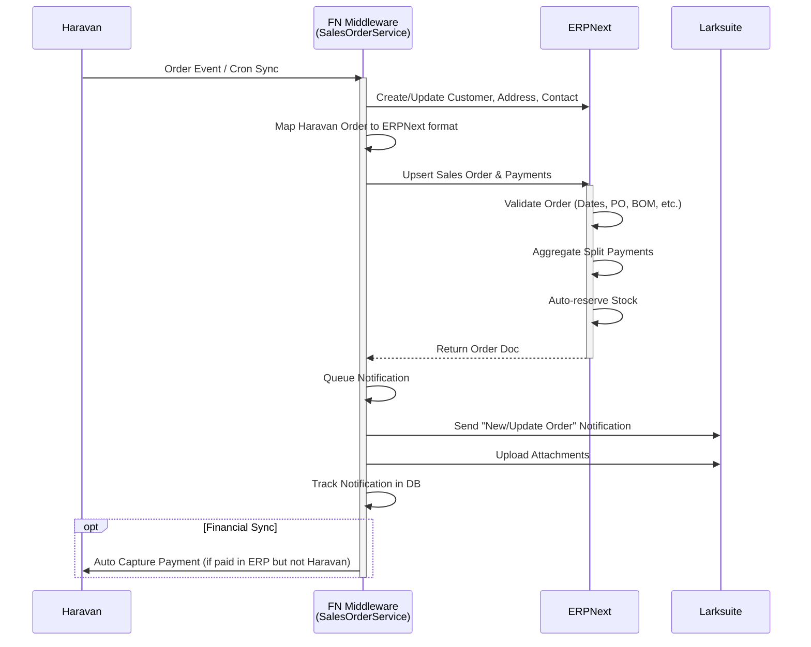
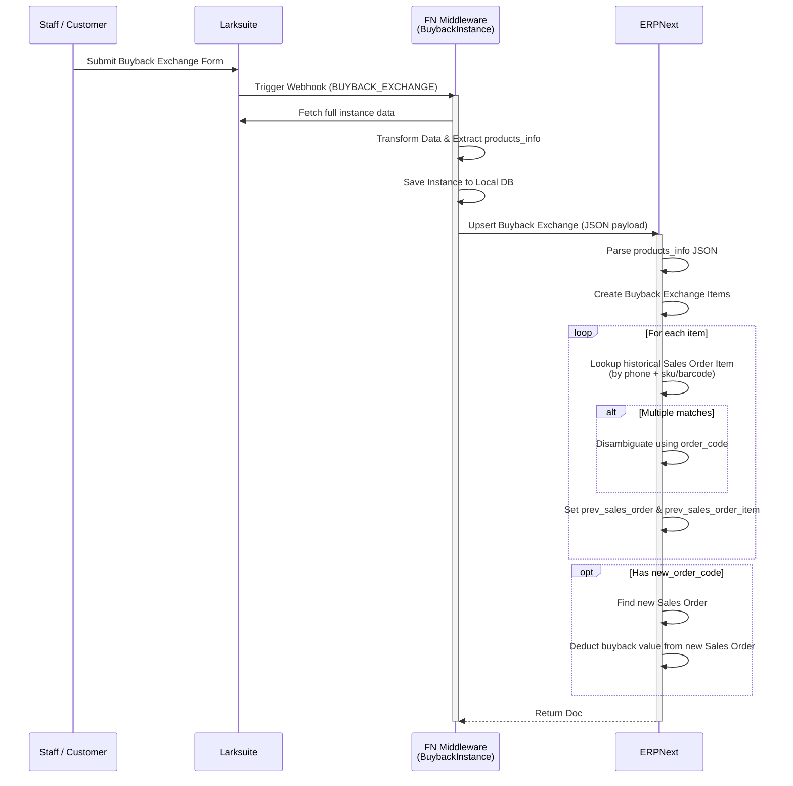

# Sales Order & Buyback Exchange Flow Documentation

This document provides a detailed technical overview of how Sales Orders and Buyback Exchanges are processed across the ecosystem, involving Haravan, the FN Middleware, ERPNext, and Larksuite.

## 1. Sales Order Flow

The Sales Order synchronization process primarily acts to pull orders from external sources (like Haravan) into ERPNext, while pushing relevant notifications to Larksuite and keeping financial statuses in sync.

### 1.1. FN Middleware (`SalesOrderService`)
**Path:** `fn/src/services/erp/selling/sales-order/sales-order.js`

The FN Middleware acts as the orchestrator for Sales Orders:
*   **Haravan Order Ingestion (`processHaravanOrder`)**: 
    *   Receives payload from Haravan. 
    *   Creates or updates Customer, Address, and Contact records in ERPNext via dedicated services (`CustomerService`, `AddressService`, `ContactService`).
    *   Maps Haravan's `line_items`, `discount_codes`, `fulfillments`, and `transactions` (captures/authorizations) into ERPNext `Sales Order` and `Sales Order Payment Record` structures.
    *   Pushes the normalized data to ERPNext using `frappeClient.upsert()`.
*   **Notifications to Larksuite (`sendNotificationToLark`)**:
    *   Triggered via a queue (`dequeueSalesOrderNotificationQueue`).
    *   Fetches the newly created or updated Sales Order from ERPNext.
    *   Aggregates data if the order is part of a "Split Order Group" (grouping items and payments from parent/child orders).
    *   Composes a detailed markdown message and sends it to the Larksuite Customer Info group.
    *   Syncs images/attachments from ERPNext to the Larksuite chat thread.
    *   Tracks notification status in the FN database (`erpnextSalesOrderNotificationTracking`) to decide whether to send a "New Order" or "Update Order" message.
*   **Financial Sync (`syncHaravanFinancialStatus`)**: 
    *   If an order is marked fully paid in ERPNext but still has a remaining balance in Haravan, the FN middleware automatically triggers a capture transaction in Haravan.

### 1.2. ERPNext Handling (`SalesOrder`)
**Path:** `erp/apps/erpnext/erpnext/selling/doctype/sales_order/sales_order.py`

When the FN Middleware upserts a Sales Order, ERPNext takes over the core business logic:
*   **Validation & State Machine**: Runs extensive validations on delivery dates, purchase orders, dropshipping, subcontracting BOMs, and reserved stock (`validate()` method).
*   **Payment Aggregation**: 
    *   `set_payment_entries()` and `set_group_payment_entries()` functions dynamically fetch linked `Payment Entry Reference`s.
    *   It calculates total allocated payments even across complex "Split Order" relationships or reference trees.
*   **Related Orders Tracking**: Uses `get_all_related_sales_orders()` to recursively traverse the `Sales Order Reference` tree and `split_order_group` to group order families.
*   **Stock Reservation**: Automatically triggers stock reservations for the ordered items if settings permit (`enable_auto_reserve_stock`).

---

## 2. Buyback Exchange Flow

The Buyback Exchange flow allows customers to return or exchange previous purchases. It is initiated by staff via a Larksuite Approval form, parsed by FN, and structurally recorded in ERPNext.

### 2.1. Initiation via Larksuite & FN Middleware
**Path:** `fn/src/services/larksuite/approval/instance/buyback-instance.js`

*   **Webhook Listener (`handleApprovalWebhook`)**:
    *   FN listens for approval webhooks from Larksuite matching the `BUYBACK_EXCHANGE` code.
    *   Upon trigger, FN queries the Larksuite API to get the full instance data (Approval Form details).
*   **Data Transformation**: 
    *   Extracts critical form fields: `customer_name`, `phone_number`, `national_id`, `reason`, `refund_amount`, `order_code`, `new_order_code`, and `products_info` (which contains JSON data of the returned items).
*   **Database Persistence**: Saves a copy of the instance in the local database `larksuiteBuybackExchangeApprovalInstance`.
*   **Push to ERPNext (`upsertToErp`)**: 
    *   Normalizes the phone number.
    *   Sends a payload to ERPNext to create a `Buyback Exchange` document. The `products_info` array is sent as a stringified JSON payload to bypass complex nested table upsert limitations.

### 2.2. Processing in ERPNext
**Paths:** 
* `erp/apps/erpnext/erpnext/selling/doctype/buyback_exchange/buyback_exchange.py`
* `erp/apps/erpnext/erpnext/selling/doctype/buyback_exchange_item`

Once ERPNext receives the `Buyback Exchange` payload from FN, the document handles the logic during the `validate()` lifecycle:
*   **Parsing Products (`process_products_info`)**: 
    *   Parses the `products_info` JSON string received from FN.
    *   Iterates through the JSON array and dynamically appends rows to the `items` child table (`Buyback Exchange Item`), extracting `item_code`, `sale_price`, `buyback_percentage`, and `buyback_price`.
*   **Historical Reference Resolution (`resolve_item_reference`)**: 
    *   Attempts to automatically link the returned items to the original `Sales Order` they were bought from.
    *   It queries past `Sales Order Item` records using the customer's `phone_number`.
    *   **Diamonds:** Looks up using a `LIKE` operator on the `sku` field.
    *   **Jewelry/Others:** Looks up using an exact match on the `barcode` field.
    *   If multiple historical orders match, it uses the provided `order_code` from Lark to disambiguate and select the exact parent `Sales Order`.
*   **Linking to New Exchange Order (`link_to_current_sales_order`)**: 
    *   If the customer is exchanging for a new item, the `new_order_code` is used to look up the newly created `Sales Order` (using `find_sales_order_by_number`).
    *   It links the `Buyback Exchange Item` to the new `Sales Order` and calls `_update_sales_order_return_amount(sales_order)` to deduct the buyback value from the new order's balance.

---

### Summary Sequence

**Sales Order:** `Haravan -> FN Middleware (Maps Data) -> ERPNext (Validates & Calculates) -> FN Middleware (Notifies) -> Larksuite Chat`

**Buyback Exchange:** `Larksuite Approval -> FN Webhook -> FN Middleware (Transforms & Upserts) -> ERPNext (Parses JSON, Links Past Orders, Applies Discounts to New Orders)`
