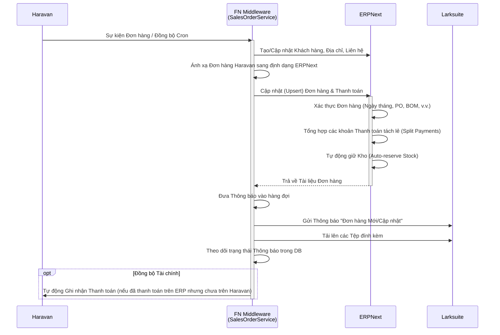
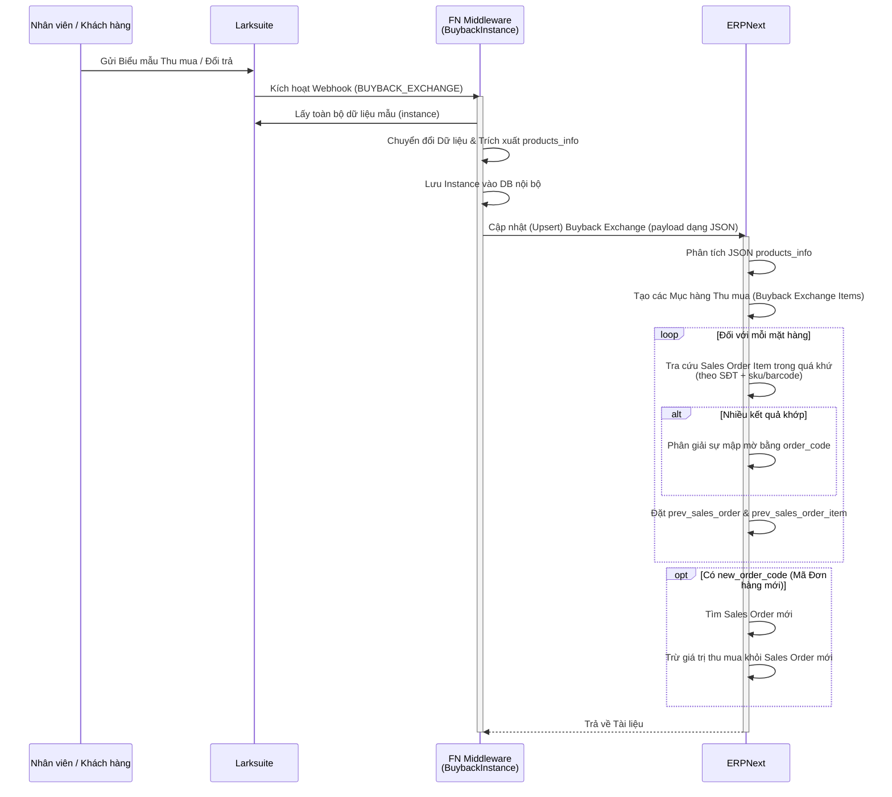

# Tài liệu Quy trình Đơn hàng (Sales Order) & Đổi trả / Thu mua (Buyback Exchange)

Tài liệu này cung cấp cái nhìn tổng quan kỹ thuật chi tiết về cách các Đơn hàng (Sales Orders) và Giao dịch Đổi trả/Thu mua (Buyback Exchanges) được xử lý xuyên suốt hệ sinh thái, liên quan đến Haravan, FN Middleware, ERPNext, và Larksuite.

## 1. Quy trình Đơn hàng (Sales Order Flow)

Quy trình đồng bộ Đơn hàng chủ yếu hoạt động để kéo các đơn hàng từ các nguồn bên ngoài (như Haravan) vào ERPNext, đồng thời đẩy các thông báo liên quan đến Larksuite và giữ cho các trạng thái tài chính được đồng bộ.

### 1.1. FN Middleware (`SalesOrderService`)
**Đường dẫn:** `fn/src/services/erp/selling/sales-order/sales-order.js`

FN Middleware hoạt động như một trình điều phối cho các Đơn hàng:
*   **Tiếp nhận Đơn hàng Haravan (`processHaravanOrder`)**: 
    *   Nhận payload từ Haravan. 
    *   Tạo hoặc cập nhật các bản ghi Khách hàng (Customer), Địa chỉ (Address), và Liên hệ (Contact) trong ERPNext thông qua các dịch vụ chuyên dụng (`CustomerService`, `AddressService`, `ContactService`).
    *   Ánh xạ các thông tin `line_items`, `discount_codes`, `fulfillments`, và `transactions` (captures/authorizations) của Haravan thành cấu trúc `Sales Order` và `Sales Order Payment Record` của ERPNext.
    *   Đẩy dữ liệu đã chuẩn hóa sang ERPNext bằng lệnh `frappeClient.upsert()`.
*   **Thông báo tới Larksuite (`sendNotificationToLark`)**:
    *   Được kích hoạt thông qua hàng đợi (`dequeueSalesOrderNotificationQueue`).
    *   Lấy Đơn hàng mới được tạo hoặc cập nhật từ ERPNext.
    *   Tổng hợp dữ liệu nếu đơn hàng thuộc "Nhóm Đơn hàng Tách lẻ" (Split Order Group - gộp các mặt hàng và thanh toán từ đơn hàng cha/con).
    *   Soạn một tin nhắn markdown chi tiết và gửi tới nhóm Larksuite Customer Info.
    *   Đồng bộ hình ảnh/tệp đính kèm từ ERPNext vào luồng chat (thread) trên Larksuite.
    *   Theo dõi trạng thái thông báo trong cơ sở dữ liệu FN (`erpnextSalesOrderNotificationTracking`) để quyết định xem sẽ gửi tin nhắn "Đơn hàng Mới" (New Order) hay "Cập nhật Đơn hàng" (Update Order).
*   **Đồng bộ Tài chính (`syncHaravanFinancialStatus`)**: 
    *   Nếu một đơn hàng được đánh dấu là đã thanh toán đầy đủ trên ERPNext nhưng vẫn còn số dư trên Haravan, FN middleware sẽ tự động kích hoạt giao dịch thu tiền (capture) trên Haravan.

### 1.2. Xử lý tại ERPNext (`Sales Order`)
**Đường dẫn:** `erp/apps/erpnext/erpnext/selling/doctype/sales_order/sales_order.py`

Khi FN Middleware thực hiện upsert một Đơn hàng, ERPNext sẽ tiếp quản phần logic nghiệp vụ cốt lõi:
*   **Xác thực & Máy trạng thái (State Machine)**: Chạy các bước xác thực toàn diện (`validate()` method) đối với ngày giao hàng, đơn đặt hàng (PO), dropshipping, hóa đơn nguyên vật liệu (BOM) thầu phụ, và hàng lưu kho. Ngoài ra, nó xác thực cụ thể:
    *   **Số sê-ri (Serial Numbers)**: Đảm bảo các mặt hàng được đánh dấu yêu cầu giao hàng theo số sê-ri phải có BOM đang hoạt động và xác thực rằng các số sê-ri cụ thể này không bị trùng lặp trên các đơn hàng không liên quan (`validate_serial_no_based_delivery`, `validate_serial_number`).
    *   **Mã giảm giá & Khuyến mãi (Coupons & Promotions)**: Xác thực các mã giảm giá của Đối tác (Partner) để đảm bảo yêu cầu KYC (Hình ảnh xác minh khách hàng) được cung cấp trước khi cho phép lưu đơn hàng. Các khuyến mãi thông thường được đồng bộ hóa nhưng không bị từ chối nghiêm ngặt trong giai đoạn này.
*   **Tổng hợp Thanh toán**: 
    *   Các hàm `set_payment_entries()` và `set_group_payment_entries()` tự động lấy các tham chiếu `Payment Entry Reference` được liên kết.
    *   Nó tính toán tổng các khoản thanh toán được phân bổ ngay cả giữa các mối quan hệ "Đơn hàng Tách lẻ" (Split Order) phức tạp hoặc cây tham chiếu.
*   **Theo dõi các Đơn hàng Liên quan**: Sử dụng `get_all_related_sales_orders()` để duyệt đệ quy cây `Sales Order Reference` và `split_order_group` để nhóm các nhóm đơn hàng.
*   **Giữ hàng Tồn kho (Stock Reservation)**: Tự động kích hoạt việc giữ kho cho các mặt hàng được đặt nếu cài đặt cho phép (`enable_auto_reserve_stock`).

---

## 2. Quy trình Đổi trả / Thu mua (Buyback Exchange Flow)

Quy trình Buyback Exchange cho phép khách hàng trả lại hoặc đổi các sản phẩm đã mua trước đó. Quy trình này do nhân viên khởi tạo thông qua biểu mẫu Duyệt (Approval form) trên Larksuite, được FN phân tích, và ghi nhận cấu trúc trong ERPNext.

### 2.1. Khởi tạo qua Larksuite & FN Middleware
**Đường dẫn:** `fn/src/services/larksuite/approval/instance/buyback-instance.js`

*   **Lắng nghe Webhook (`handleApprovalWebhook`)**:
    *   FN lắng nghe các webhook phê duyệt từ Larksuite khớp với mã `BUYBACK_EXCHANGE`.
    *   Khi được kích hoạt, FN truy vấn API Larksuite để lấy toàn bộ dữ liệu instance (chi tiết Approval form).
*   **Chuyển đổi Dữ liệu**: 
    *   Trích xuất các trường quan trọng của form: `customer_name`, `phone_number`, `national_id`, `reason`, `refund_amount`, `order_code`, `new_order_code`, và `products_info` (chứa dữ liệu JSON của các mặt hàng được trả lại).
*   **Lưu trữ DB**: Lưu một bản sao của form vào cơ sở dữ liệu nội bộ `larksuiteBuybackExchangeApprovalInstance`.
*   **Đẩy sang ERPNext (`upsertToErp`)**: 
    *   Chuẩn hóa số điện thoại.
    *   Gửi một payload tới ERPNext để tạo doctype `Buyback Exchange`. Mảng `products_info` được gửi dưới dạng chuỗi payload JSON để lách qua các giới hạn cập nhật bảng lồng nhau phức tạp.

### 2.2. Xử lý tại ERPNext
**Các đường dẫn:** 
* `erp/apps/erpnext/erpnext/selling/doctype/buyback_exchange/buyback_exchange.py`
* `erp/apps/erpnext/erpnext/selling/doctype/buyback_exchange_item`

Khi ERPNext nhận payload `Buyback Exchange` từ FN, tài liệu sẽ xử lý các logic trong vòng đời `validate()`:
*   **Phân tích Sản phẩm (`process_products_info`)**: 
    *   Phân tích chuỗi JSON `products_info` nhận được từ FN.
    *   Lặp qua mảng JSON và nối động các hàng vào bảng con `items` (`Buyback Exchange Item`), trích xuất các trường `item_code`, `sale_price`, `buyback_percentage`, và `buyback_price`.
*   **Phân giải Tham chiếu Lịch sử (`resolve_item_reference`)**: 
    *   Cố gắng liên kết tự động các mặt hàng bị trả lại với `Sales Order` gốc mà chúng đã được mua.
    *   Nó truy vấn các bản ghi `Sales Order Item` trong quá khứ sử dụng `phone_number` của khách hàng.
    *   **Kim cương:** Tra cứu sử dụng toán tử `LIKE` trên trường `sku`.
    *   **Trang sức/Khác:** Tra cứu sử dụng so khớp chính xác trên trường `barcode`.
    *   Nếu có nhiều đơn hàng trong quá khứ khớp, nó sẽ sử dụng `order_code` được cung cấp từ Lark để xử lý trùng lặp và chọn chính xác `Sales Order` cha.
*   **Liên kết với Đơn hàng Đổi trả Mới (`link_to_current_sales_order`)**: 
    *   Nếu khách hàng đổi lấy một mặt hàng mới, mã `new_order_code` được sử dụng để tìm kiếm `Sales Order` mới được tạo (sử dụng `find_sales_order_by_number`).
    *   Nó liên kết `Buyback Exchange Item` với `Sales Order` mới và gọi `_update_sales_order_return_amount(sales_order)` để khấu trừ giá trị thu mua khỏi số dư của đơn hàng mới.

---

### Tóm tắt Trình tự

**Quy trình Đơn hàng (Sales Order):** `Haravan -> FN Middleware (Ánh xạ Dữ liệu) -> ERPNext (Xác thực & Tính toán) -> FN Middleware (Thông báo) -> Khung Chat Larksuite`

**Quy trình Đổi trả / Thu mua (Buyback Exchange):** `Phê duyệt Larksuite -> FN Webhook -> FN Middleware (Chuyển đổi & Upsert) -> ERPNext (Phân tích JSON, Liên kết Đơn hàng Cũ, Áp dụng Giảm giá cho Đơn hàng Mới)`
