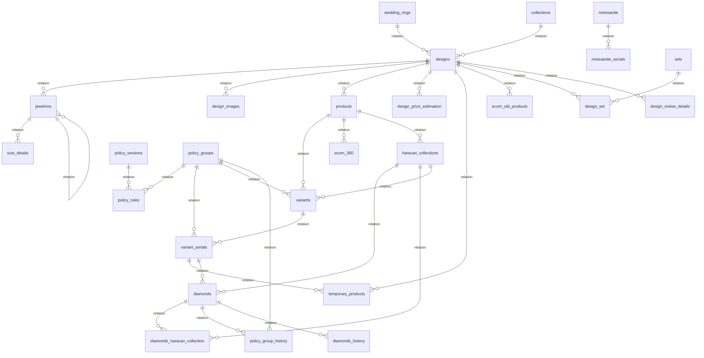

# NocoDB Base ERD and Webhooks Reference - Marketing

This document provides a complete reference of the NocoDB workspace tables, relationships (ERD), and active webhooks for the **Marketing** base.

## Database Overview
* **Base ID**: `pbzopuiobhc8xf1`
* **Total Tables**: 39
* **Active Webhooks**: 9

---

## Entity-Relationship Diagram (ERD)

---

## Tables and Relations

| Table Name | Primary Key | Columns Count | Relations (Linked Tables) |
|---|---|---|---|
| **designs** | `id` | 88 | `jewelries` -> **jewelries** (hm) `design_images` -> **design_images** (hm) `products` -> **products** (hm) `design_price_estimations` -> **design_price_estimation** (hm) `temporary_products` -> **temporary_products** (hm) `ecom_old_products` -> **ecom_old_products** (hm) `design_sets` -> **design_set** (hm) `_nc_m2m_design_melee_de_designs` -> **unknown** (hm) `design_melee_details` -> **design_melee_details** (mm) |
| **moissanite_serials** | `id` | 6 | *None* |
| **design_price_estimation** | `id` | 6 | *None* |
| **products** | `id` | 51 | `variants` -> **variants** (hm) `ecom_360s` -> **ecom_360** (hm) `products_haravan_collections` -> **unknown** (hm) `haravan_collections` -> **haravan_collections** (mm) |
| **variant_serials** | `id` | 69 | `temporary_products` -> **temporary_products** (hm) `variant_serials_diamonds` -> **unknown** (hm) `diamonds` -> **diamonds** (mm) |
| **temporary_products** | `id` | 32 | *None* |
| **variant_serials_lark** | `id` | 3 | *None* |
| **wedding_rings** | `id` | 4 | `designs` -> **designs** (hm) |
| **moissanite** | `id` | 18 | `moissanite_serials` -> **moissanite_serials** (hm) |
| **diamond_price_list** | `id` | 8 | *None* |
| **melee_diamonds** | `id` | 10 | *None* |
| **designs_temporary_products** | `id` | 10 | *None* |
| **diamonds** | `id` | 54 | `diamonds_haravan_collections` -> **diamonds_haravan_collection** (hm) `policy_group_histories` -> **policy_group_history** (hm) `variant_serials_diamonds` -> **unknown** (hm) `variant_serials` -> **variant_serials** (mm) `diamonds_history_diamonds` -> **unknown** (hm) `diamonds_histories` -> **diamonds_history** (mm) |
| **ecom_360** | `id` | 6 | *None* |
| **diamonds_haravan_collection** | `diamond_id` | 10 | *None* |
| **materials** | `id` | 8 | *None* |
| **collections** | `id` | 11 | `designs` -> **designs** (hm) |
| **jewelries** | `id` | 59 | `size_details` -> **size_details** (hm) `jewelries` -> **jewelries** (hm) |
| **ecom_old_products** | `id` | 14 | *None* |
| **design_details** | `id` | 9 | *None* |
| **design_set** | `id` | 8 | *None* |
| **sets** | `id` | 14 | `design_sets` -> **design_set** (hm) |
| **submitted_codes** | `id` | 9 | *None* |
| **haravan_collections** | `id` | 27 | `diamonds` -> **diamonds** (hm) `products` -> **products** (hm) `diamonds_haravan_collections` -> **diamonds_haravan_collection** (hm) `products_haravan_collections` -> **unknown** (hm) `products1` -> **products** (mm) `variants` -> **variants** (mm) |
| **temporary_products_web** | `id` | 32 | *None* |
| **design_images** | `id` | 24 | *None* |
| **design_melee_details** | `id` | 16 | `_nc_m2m_design_melee_de_designs` -> **unknown** (hm) `designs` -> **designs** (mm) |
| **variants** | `id` | 45 | `variant_serials` -> **variant_serials** (hm) `haravan_collections` -> **haravan_collections** (mm) |
| **policy_rules** | `id` | 22 | *None* |
| **policy_versions** | `id` | 16 | `policy_rules` -> **policy_rules** (hm) |
| **policy_group_history** | `id` | 15 | *None* |
| **policy_groups** | `id` | 16 | `policy_rules` -> **policy_rules** (hm) `variant_serials` -> **variant_serials** (hm) `variants` -> **variants** (hm) `policy_group_histories` -> **policy_group_history** (hm) |
| **temtab** | `id` | 20 | *None* |
| **size_details** | `id` | 13 | *None* |
| **promotions** | `id` | 17 | *None* |
| **salesaya_temporary_product** | `id` | 1 | *None* |
| **salesaya_haravan_collections** | `id` | 6 | *None* |
| **diamonds_history** | `id` | 21 | `diamonds_history_diamonds` -> **unknown** (hm) `diamonds` -> **diamonds** (mm) |
| **design_event_jobs** | `Id` | 16 | *None* |

---

## Webhook Configurations

The following webhooks are configured across the NocoDB tables:

| Source Table | Webhook Title | Event / Operation | Active | Method | Destination / Path | Condition |
|---|---|---|---|---|---|---|
| **diamonds_haravan_collection** | Collect Haravan | `after` on `insert, update, delete` | ✅ Yes | `POST` | `https://fn.jemmia.vn/webhook/noco/collects` | `false` |
| **sets** | Tạo bộ trang sức | `after` on `insert, update, delete` | ✅ Yes | `POST` | `https://fn.jemmia.vn/webhook/noco/sets` | `false` |
| **submitted_codes** | Check Out | `manual` on `trigger` | ✅ Yes | `POST` | `https://fn.jemmia.vn/webhook/noco/submitted-codes/process?type=checkout` | `false` |
| **submitted_codes** | Apply | `manual` on `trigger` | ✅ Yes | `POST` | `https://fn.jemmia.vn/webhook/noco/submitted-codes/process` | `false` |
| **haravan_collections** | Create Collection | `after` on `update` | ✅ Yes | `POST` | `https://fn.jemmia.vn/webhook/noco/haravan-collections` | `true` |
| **haravan_collections** | Update collection | `manual` on `trigger` | ✅ Yes | `POST` | `https://fn.jemmia.vn/webhook/noco/haravan-collections` | `false` |
| **design_images** | sync retouch images | `manual` on `trigger` | ✅ Yes | `POST` | `https://fn.jemmia.vn/webhook/noco/design-images/retouch-upload` | `false` |
| **design_images** | Retouch to haravan | `manual` on `trigger` | ✅ Yes | `POST` | `https://fn.jemmia.vn/webhook/noco/design-images/retouch-to-haravan` | `false` |
| **design_images** | Tick to Sync Haravan Retouch | `after` on `update` | ✅ Yes | `POST` | `https://fn.jemmia.vn/webhook/noco/design-images/retouch-to-haravan` | `true` |
