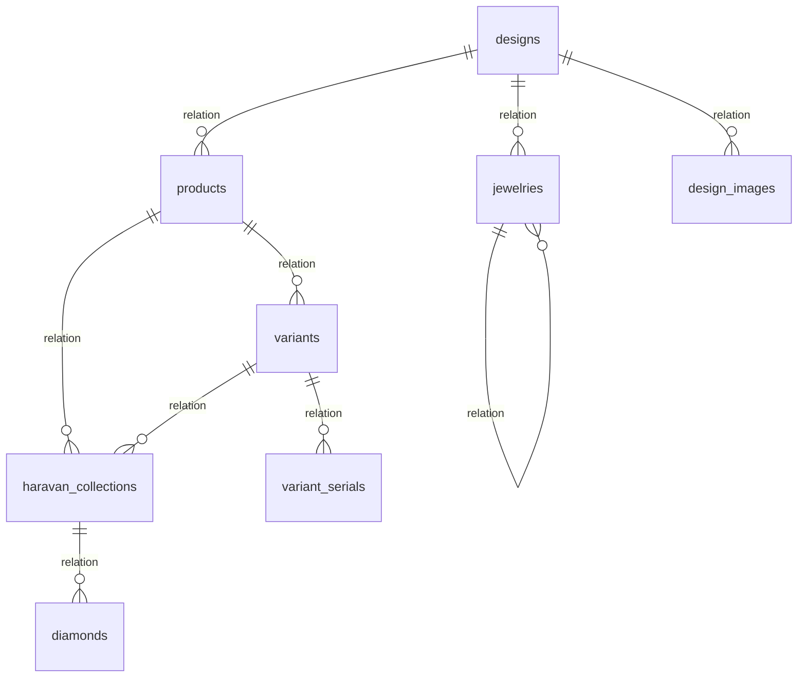

# NocoDB Base ERD and Webhooks Reference

This document provides a complete reference of the NocoDB workspace tables, relationships (ERD), and active webhooks.

## Database Overview
* **Base ID**: `pl4e7zwnui0k8y1`
* **Total Tables**: 39
* **Active Webhooks**: 7

---

## Entity-Relationship Diagram (ERD)

---

## Tables and Relations

| Table Name | Primary Key | Columns Count | Relations (Linked Tables) |
|---|---|---|---|
| **diamonds** | `id` | 65 | `diamonds_haravan_collections` -> **diamonds_haravan_collection** (hm) `policy_group_history` -> **policy_group_history** (hm) `_nc_m2m_variant_serials_diamonds` -> **unknown** (hm) |
| **moissanite_serials** | `id` | 10 | *None* |
| **melee_diamonds** | `id` | 17 | *None* |
| **moissanite** | `id` | 32 | `moissanite_serials` -> **moissanite_serials** (hm) |
| **diamond_price_list** | `id` | 10 | *None* |
| **products** | `id` | 58 | `variants` -> **variants** (hm) `ecom_360s` -> **ecom_360** (hm) `_nc_m2m_haravan_collect_products` -> **unknown** (hm) `haravan_collections1` -> **haravan_collections** (mm) |
| **variants** | `id` | 62 | `variant_serials` -> **variant_serials** (hm) `variants_haravan_collections` -> **unknown** (hm) `haravan_collections` -> **haravan_collections** (mm) |
| **variant_serials** | `id` | 75 | `temporary_products` -> **temporary_products** (hm) `_nc_m2m_variant_serials_diamonds` -> **unknown** (hm) |
| **variant_serials_lark** | `id` | 3 | *None* |
| **temporary_products** | `id` | 33 | *None* |
| **jewelries** | `id` | 88 | `size_details` -> **size_details** (hm) `jewelries1` -> **jewelries** (hm) |
| **haravan_collections** | `id` | 24 | `diamonds` -> **diamonds** (hm) `_nc_m2m_haravan_collect_products` -> **unknown** (hm) `products1` -> **products** (mm) `products` -> **products** (hm) `diamonds_haravan_collections` -> **diamonds_haravan_collection** (hm) `variants_haravan_collections` -> **unknown** (hm) `variants` -> **variants** (mm) |
| **designs** | `id` | 74 | `jewelries` -> **jewelries** (hm) `design_images` -> **design_images** (hm) `products` -> **products** (hm) `design_price_estimations` -> **design_price_estimation** (hm) `temporary_products` -> **temporary_products** (hm) `ecom_old_products` -> **ecom_old_products** (hm) `design_sets` -> **design_set** (hm) `designs_design_event_jobs` -> **unknown** (hm) `design_event_jobs` -> **design_event_jobs** (mm) |
| **design_melee_details** | `Id` | 19 | *None* |
| **design_details** | `id` | 12 | *None* |
| **design_images** | `id` | 15 | *None* |
| **design_set** | `id` | 7 | *None* |
| **collections** | `id` | 10 | `designs` -> **designs** (hm) |
| **wedding_rings** | `id` | 4 | `designs` -> **designs** (hm) |
| **materials** | `id` | 9 | *None* |
| **size_details** | `id` | 13 | *None* |
| **submitted_codes** | `id` | 7 | *None* |
| **design_price_estimation** | `id` | 6 | *None* |
| **temporary_products_web** | `id` | 32 | *None* |
| **designs_temporary_products** | `id` | 10 | *None* |
| **ecom_old_products** | `id` | 14 | *None* |
| **sets** | `id` | 10 | `design_sets` -> **design_set** (hm) |
| **ecom_360** | `id` | 5 | *None* |
| **temtab** | `id` | 20 | *None* |
| **promotions** | `id` | 17 | *None* |
| **diamonds_haravan_collection** | `diamond_id` | 9 | *None* |
| **policy_versions** | `id` | 16 | `policy_rules` -> **policy_rules** (hm) |
| **policy_groups** | `id` | 17 | `policy_rules` -> **policy_rules** (hm) `variants` -> **variants** (hm) `variant_serials` -> **variant_serials** (hm) `policy_group_history` -> **policy_group_history** (hm) |
| **policy_group_history** | `id` | 22 | *None* |
| **policy_rules** | `id` | 29 | *None* |
| **salesaya_temporary_product** | `id` | 1 | *None* |
| **salesaya_haravan_collections** | `id` | 6 | *None* |
| **diamonds_history** | `Id` | 24 | *None* |
| **design_event_jobs** | `id` | 16 | `designs_design_event_jobs` -> **unknown** (hm) `designs` -> **designs** (mm) |

---

## Webhook Configurations

The following webhooks are configured across the NocoDB tables:

| Source Table | Webhook Title | Event / Operation | Active | Method | Destination / Path | Condition |
|---|---|---|---|---|---|---|
| **diamonds** | Create Product Haravan | `after` on `update` | ✅ Yes | `POST` | `https://fn.jemmia.vn/webhook/noco/diamonds` | `true` |
| **moissanite_serials** | Tạo rFID | `manual` on `trigger` | ✅ Yes | `POST` | `https://fn.jemmia.vn/webhook/noco/moissanite-serials/rfid` | `false` |
| **moissanite** | product creator | `after` on `update` | ✅ Yes | `POST` | `https://fn.jemmia.vn/webhook/noco/moissanite` | `true` |
| **products** | Auto create Product On Haravan | `after` on `update` | ✅ Yes | `POST` | `https://fn.jemmia.vn/webhook/noco/products` | `true` |
| **variants** | Create variant | `after` on `update` | ✅ Yes | `POST` | `https://fn.jemmia.vn/webhook/noco/variants` | `true` |
| **variant_serials** | Generate RFID | `manual` on `trigger` | ✅ Yes | `POST` | `https://fn.jemmia.vn/webhook/noco/variant-serials/rfid` | `false` |
| **jewelries** | Auto create Jewelry Product On Haravan | `after` on `update` | ❌ No (Deprecated) | `POST` | - | `true` |
